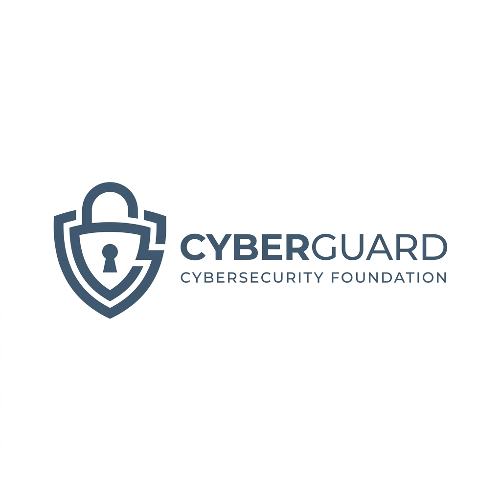

<div align="center">
    
    <h1>ThreatRadar</h1>
    <p><b>A modern, open-source platform for static threat intelligence and malware analysis.</b></p>
</div>

<br>

## Overview
ThreatRadar provides a clean, secure, and fast web interface to upload suspicious files and scan them against over 70 top-tier antivirus engines and URL/domain blocklisting services. It utilizes the powerful [VirusTotal v3 API](https://developers.virustotal.com/reference/overview) in the backend while providing a streamlined, community-driven front-end experience.

## Features
- **Comprehensive Scanning:** Submit files securely to VirusTotal.
- **Immediate Polling:** Instantaneous Analysis ID generation with asynchronous polling.
- **Safe Evaluation Environment:** Includes safe, industry-standard test strings (like EICAR) to evaluate the system without risk.
- **Open Source Aesthetic:** Built with a premium, classic open-source project layout.

## Installation

### Prerequisites
- PHP 8.0 or higher
- cURL extension enabled in `php.ini`
- Valid SSL certificate configured in `php.ini` (`curl.cainfo`)

### Setup
1. Clone the repository:
   ```bash
   git clone https://github.com/Harshit23cyber/ThreatRadar.git
   cd ThreatRadar
   ```
2. Update the API Key:
   Open `config.php` and replace the placeholder `VIRUSTOTAL_API_KEY` with your actual VirusTotal API key.
   ```php
   define('VIRUSTOTAL_API_KEY', 'your_key_here');
   ```
3. Start the built-in PHP server (using our custom router):
   ```bash
   php -S localhost:8080 router.php
   ```

## Usage
Navigate to `http://localhost:8080` in your browser. Upload any file (up to the configured 32MB limit) to instantly retrieve its scan results. 

To test the integration safely, navigate to the `/samples` page to download harmless test files that trigger specific API responses.

## Licensing
This project is released under the MIT License. See the [LICENSE](LICENSE) file for details. Data returned by the API is subject to the [DATA_LICENSE.txt](DATA_LICENSE.txt) and the [Terms of Service](TERMS_OF_SERVICE.md).

## Contributors
We welcome pull requests! Huge thanks to our core contributors:
- [@Harshit23cyber](https://github.com/Harshit23cyber)
- [@nareshnarayanofficial](https://github.com/nareshnarayanofficial)
