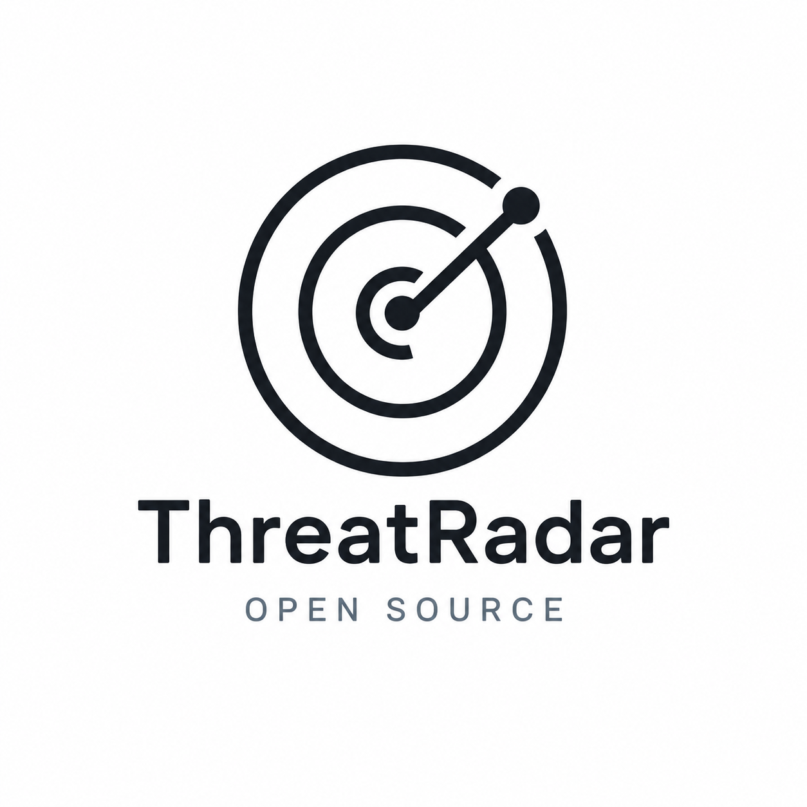

<div align="center">
  

  # ThreatRadar
  **A high-performance, open-source platform for static threat intelligence and malware analysis.**

  [](https://opensource.org/licenses/MIT)
  [](https://php.net/)
  [](https://developers.virustotal.com/)
  [](https://github.com/Harshit23cyber/ThreatRadar/issues)

  [Overview](#overview) •
  [Features](#features) •
  [Installation](#installation) •
  [Usage](#usage) •
  [Documentation](#documentation) •
  [Contributing](#contributing)
</div>

---

## Overview

ThreatRadar provides a clean, secure, and lightning-fast web interface to upload suspicious files and scan them against over 70 top-tier antivirus engines and URL/domain blocklisting services. Powered by the [VirusTotal v3 API](https://developers.virustotal.com/reference/overview), it delivers comprehensive deep-file metadata right to your browser with a streamlined, community-driven front-end experience.

## Features

- 🛡️ **Comprehensive Scanning:** Submit files securely and directly to VirusTotal's backend.
- ⚡ **Real-Time Polling:** Instantaneous Analysis ID generation with seamless asynchronous polling.
- 📊 **Deep Metadata Extraction:** View comprehensive file properties including MD5, SHA-256, SSDEEP, TLSH, Magic bytes, and Submission History natively in a clean tabbed UI.
- 🧪 **Safe Evaluation Environment:** Includes safe, industry-standard test files (like EICAR) to evaluate your deployment without risk.
- 🎨 **Premium Aesthetic:** Built with a modern, zero-dependency CSS framework inspired by enterprise open-source tools.

## Installation

### Prerequisites
Before you begin, ensure you have the following installed and configured:
- **PHP 8.0** or higher
- The `cURL` extension enabled in your `php.ini`
- A valid SSL certificate configured in your `php.ini` (`curl.cainfo`) to securely connect to the VirusTotal API.

### Setup Instructions

1. **Clone the repository**
   ```bash
   git clone https://github.com/Harshit23cyber/ThreatRadar.git
   cd ThreatRadar
   ```

2. **Configure API Credentials**
   Open the `config.php` file and replace the placeholder `VIRUSTOTAL_API_KEY` with your actual, valid VirusTotal API key.
   ```php
   // config.php
   define('VIRUSTOTAL_API_KEY', 'your_secure_api_key_here');
   ```

3. **Start the Development Server**
   ThreatRadar includes a custom router (`router.php`) for clean, extension-less URLs. Run it using PHP's built-in server:
   ```bash
   php -S localhost:8080 router.php
   ```

## Usage

1. Navigate to `http://localhost:8080` in your web browser.
2. Upload any suspicious file (up to the default configured limit of **32MB**).
3. The file will be instantly uploaded and scanned, and you will be automatically redirected to the `/results` page to view the live analysis.

> **Note:** To test the integration safely, navigate to the `/samples` page to download harmless test files (such as `eicar.com`) that safely trigger expected API detection responses.

## Architecture

ThreatRadar utilizes a lightweight, modern PHP architecture avoiding heavy frameworks to ensure maximum speed and minimal surface area for vulnerabilities. All API interactions are handled securely via backend PHP cURL processes to prevent API key leakage to the client.

## Documentation

For full documentation, please see the specific pages integrated within the platform:
- [API Reference](https://developers.virustotal.com/reference/overview)
- [Terms of Service](TERMS_OF_SERVICE.md)
- [Data License](DATA_LICENSE.txt)

## Contributing

We welcome pull requests and issues from the community! Huge thanks to our core maintainers:

* [@Harshit23cyber](https://github.com/Harshit23cyber)
* [@nareshnarayanofficial](https://github.com/nareshnarayanofficial)

If you'd like to contribute, please fork the repository and use a feature branch. Pull requests are warmly welcome.

## License

This software project is proudly released under the [MIT License](LICENSE). 
Data returned by the VirusTotal API is subject to their respective terms and our [Data Usage License](DATA_LICENSE.txt).
